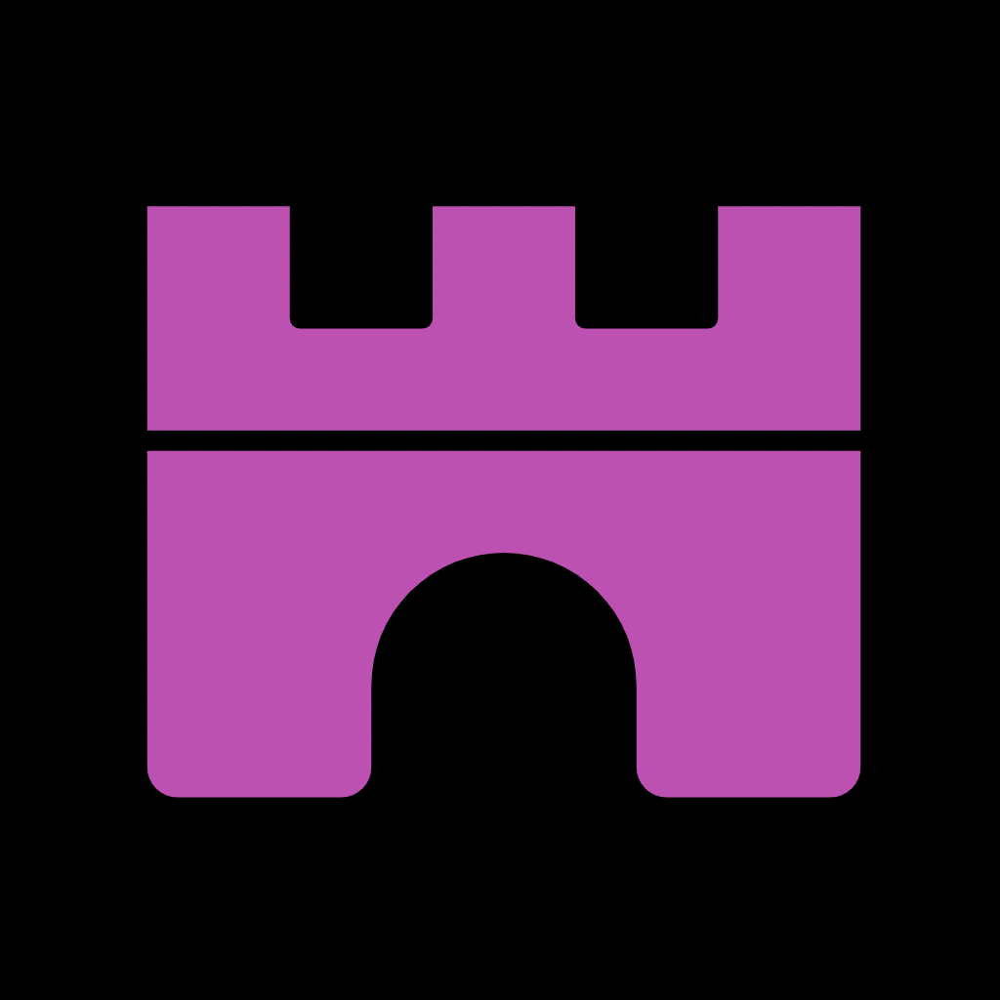

<div id="top"></div>

<!-- 
  TODO: Add these
[![Contributors][contributors-shield]][contributors-url]
[![Forks][forks-shield]][forks-url]
[![Stargazers][stars-shield]][stars-url]
[![Issues][issues-shield]][issues-url]
[![MIT License][license-shield]][license-url]
[![LinkedIn][linkedin-shield]][linkedin-url]

 -->

<!-- PROJECT LOGO -->
<br />
<div align="center">
  <a href="https://github.com/reillyjodonnell/memesfr-beta">
    
  </a>

  <h3 align="center">Memesfr</h3>

  <p align="center">
    Dank memes for everybody!
    <br />
    <br />
    <a href="https://beta.memesfr.com">View Demo</a>
    ·
    <a href="https://github.com/reillyjodonnell/memesfr-beta/issues">Report Bug</a>
    ·
    <a href="https://github.com/reillyjodonnell/memesfr-beta/issues">Request Feature</a>
  </p>
</div>


<!-- TABLE OF CONTENTS -->
<details>
  <summary>Table of Contents</summary>
  <ol>
    <li>
      <a href="#about-the-project">About The Project</a>
      <ul>
        <li><a href="#built-with">Built With</a></li>
      </ul>
    </li>
    <li>
      <a href="#getting-started">Getting Started</a>
      <ul>
        <li><a href="#prerequisites">Prerequisites</a></li>
        <li><a href="#installation">Installation</a></li>
      </ul>
    </li>
    <li><a href="#usage">Usage</a></li>
    <li><a href="#roadmap">Roadmap</a></li>
    <li><a href="#contributing">Contributing</a></li>
    <li><a href="#license">License</a></li>
    <li><a href="#contact">Contact</a></li>
    <li><a href="#acknowledgments">Acknowledgments</a></li>
  </ol>
</details>


<!-- ABOUT THE PROJECT -->
## About The Project

[![Memesfr Screen Shot][product-screenshot]](https://beta.memesfr.com)

Thanks so much for checking this project out ❤️

I absolutely love dank memes. I'm dissapointed about the lack of quality memes on mainstream social medias so I built a website as a castle for all the memelords across the land.

<p align="right">(<a href="#top">back to top</a>)</p>


### Built With

This application utilizes CRA (Create-React-AP) as a SPA (Single-Page-Application) rendered client-side.

* [React.js](https://reactjs.org/)
* [Firebase](https://firebase.google.com/)

<p align="right">(<a href="#top">back to top</a>)</p>


<!-- GETTING STARTED -->
## Getting Started

Here's how to the get the application up and running on your machine!

### Prerequisites

This project uses yarn, so be sure to have yarn installed. If you don't go to [Yarn's website](https://yarnpkg.com/)

### Installation

_First clone, or fork, the project. Then run yarn._

1. Clone the repo
   ```sh
   git clone https://github.com/reillyjodonnell/memefr-beta.git
   ```
3. Install Yarn packages
   ```sh
   yarn install
   ```
Now you're good to go! 

<p align="right">(<a href="#top">back to top</a>)</p>


<!-- USAGE EXAMPLES -->
## Usage

Use this space to show useful examples of how a project can be used. Additional screenshots, code examples and demos work well in this space. You may also link to more resources.

_For more examples, please refer to the [Documentation](https://example.com)_

<p align="right">(<a href="#top">back to top</a>)</p>


<!-- ROADMAP -->
## Roadmap

- [x] Implement login and logout functionality
- [ ] Implement create post functionality
- [ ] Migrate to Remix
- [ ] Continue to update Roadmap/ README
- [ ] Continuously support multiple languages such as:
    - [ ] Chinese
    - [ ] Spanish
    - [ ] Arabic
    - [ ] Japanese
    - [ ] And many more...

See the [open issues](https://github.com/reillyjodonnell/memesfr-beta/issues) for a full list of issues (proposed & known).

<p align="right">(<a href="#top">back to top</a>)</p>


<!-- CONTRIBUTING -->
## Contributing

Any contributions are **greatly appreciated**.

If you have a suggestion that would make this better, please fork the repo and create a pull request. You can also simply open an issue with the tag "enhancement".
Don't forget to give the project a star! Thanks again!

1. Fork the Project
2. Create your Feature Branch (`git checkout -b feature/AmazingFeature`)
3. Commit your Changes (`git commit -m 'Add some AmazingFeature'`)
4. Push to the Branch (`git push origin feature/AmazingFeature`)
5. Open a Pull Request

<p align="right">(<a href="#top">back to top</a>)</p>


<!-- LICENSE -->
## License

Distributed under the MIT License. See `LICENSE.txt` for more information.

<p align="right">(<a href="#top">back to top</a>)</p>


<!-- CONTACT -->
## Contact

Reilly - [@reillyjodonnell](https://twitter.com/reillyjodonnell) - odonnell.reilly.j@gmail.com

Project Link: [https://github.com/reillyjodonnell/memesfr-beta](https://github.com/reillyjodonnell/memesfr-beta)

<p align="right">(<a href="#top">back to top</a>)</p>


<!-- ACKNOWLEDGMENTS -->
## Acknowledgments

This project couldn't have been possible without these awesome project!
* [GitHub Pages](https://pages.github.com)
* [Font Awesome](https://fontawesome.com)
* [React router](https://ReactRouter.com)

<p align="right">(<a href="#top">back to top</a>)</p>


<!-- MARKDOWN LINKS & IMAGES -->
<!-- https://www.markdownguide.org/basic-syntax/#reference-style-links -->
[contributors-shield]: https://img.shields.io/github/contributors/othneildrew/Best-README-Template.svg?style=for-the-badge
[contributors-url]: https://github.com/reillyjodonnell/memesfr-beta/graphs/contributors
[forks-shield]: https://img.shields.io/github/forks/reill/Best-README-Template.svg?style=for-the-badge
[forks-url]: https://github.com/reillyjodonnell/memesfr-beta/network/members
[stars-shield]: https://img.shields.io/github/stars/othneildrew/Best-README-Template.svg?style=for-the-badge
[stars-url]: https://github.com/reillyjodonnell/memesfr-beta/stargazers
[issues-shield]: https://img.shields.io/github/issues/othneildrew/Best-README-Template.svg?style=for-the-badge
[issues-url]: https://github.com/reillyjodonnell/memesfr-beta/issues
[license-shield]: https://img.shields.io/github/license/othneildrew/Best-README-Template.svg?style=for-the-badge
[license-url]: https://github.com/reillyjodonnell/memesfr-beta/blob/master/LICENSE.txt
[linkedin-shield]: https://img.shields.io/badge/-LinkedIn-black.svg?style=for-the-badge&logo=linkedin&colorB=555
[linkedin-url]: https://linkedin.com/in/reillyjodonnell
[product-screenshot]: ./src/assets/Memesfr-desktop.png
